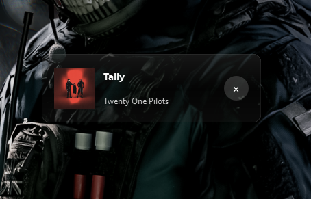

# Spotify Overlay v2.0 - Streamer Edition

<div align="center">
  
  
</div>

A beautiful, transparent overlay for controlling Spotify during gameplay or streaming. Always on top, always stylish.

## 🚀 One-Click Setup

**For End Users (No technical knowledge required):**

1. **Download** the latest release from the [Releases page](#)
2. **Run** `SpotifyOverlay.exe`
3. **Follow** the setup wizard (takes 2 minutes)
4. **Enjoy** controlling Spotify without alt-tabbing!

## 📋 Manual Setup (Advanced)

If you prefer to set up manually:

### Step 1: Create Spotify App
1. Go to [Spotify Developer Dashboard](https://developer.spotify.com/dashboard/)
2. Click "Create App"
3. Fill in:
   - **App Name:** `Spotify Overlay`
   - **Description:** `Overlay for streamers`
   - **Redirect URI:** `http://localhost:8888/callback`
4. Click "Create"

### Step 2: Get Credentials
1. Copy your **Client ID**
2. Click "Show Client Secret" and copy it
3. Run the app and paste when prompted

### Step 3: Authorize
1. The app will open Spotify in your browser
2. Click "Agree" to grant permissions
3. The overlay will appear on your screen!

## 🎮 Features

- **Transparent Design**: 20% opacity, minimal distraction
- **Always on Top**: Stays visible during gameplay
- **Quick Controls**: Play/pause, skip, volume, playlists
- **Keyboard Shortcuts**: Full control without mouse
- **Queue View**: See what's coming next
- **Drag & Reposition**: Move anywhere on screen

## ⌨️ Keyboard Shortcuts

| Shortcut | Action |
|----------|--------|
| `Ctrl+Shift+Space` | Play/Pause |
| `Ctrl+Shift+N` | Next Track |
| `Ctrl+Shift+B` | Previous Track |
| `Ctrl+Shift+Q` | Show Queue |
| `Ctrl+Shift+L` | Show Playlists |

## 🔧 Troubleshooting

### Common Issues:

**"Credentials Invalid"**
- Ensure you copied the entire Client ID and Secret
- Check for extra spaces
- Try creating a new Spotify app

**"Overlay Not Showing"**
- Make sure Spotify is running
- Check if the overlay is behind other windows
- Restart the application

**"Controls Not Working"**
- Ensure you authorized the app
- Check that Spotify is playing music
- Verify internet connection

### Need More Help?
- Check the `QUICK_START.txt` file included with the app
- [Open an issue](../../issues) on GitHub
- Email support: [YourEmail@domain.com]

## 🛠️ For Developers

```bash
# Clone the repository
git clone https://github.com/yourusername/spotify-overlay.git

# Install dependencies
pip install -r requirements.txt

# Run the application
python main.py


